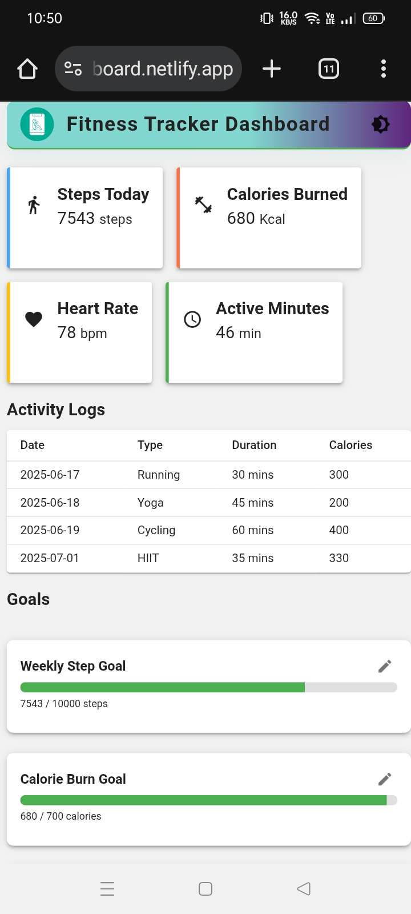
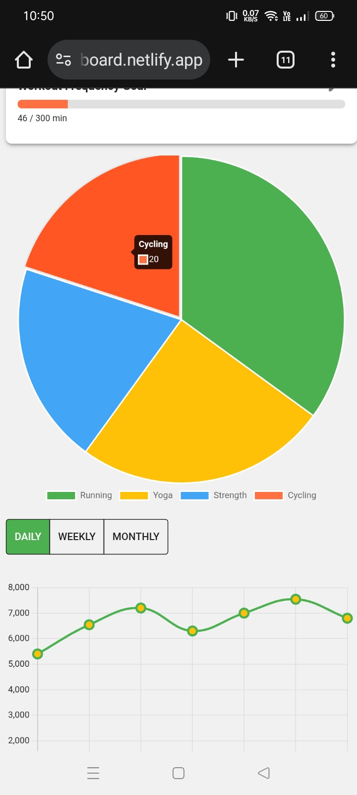
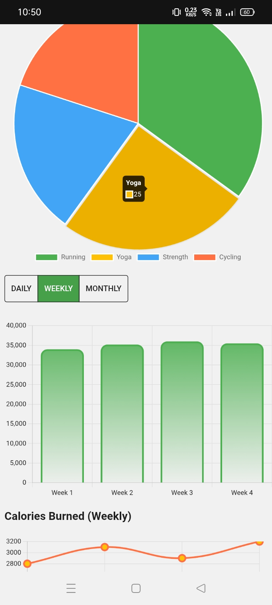

# Fitness Dashboard for Mobile

A visually stunning, interactive, and responsive Fitness Tracker Dashboard built with React.js, Material UI, and Chart.js. Track your fitness stats, activity logs, goals, and progress with beautiful charts and cards.

## Features

- **Modern UI:** Responsive layout with Material UI and custom theming (light/dark mode)
- **Stats Cards:** Steps, Calories, Heart Rate, Active Minutes
- **Activity Logs:** Table with 15+ sample entries, expandable with "Show More"
- **Goals Panel:** Editable goals (steps, calories, workouts) with animated progress bars
- **Charts:**
  - Activity Chart (line/bar, daily/weekly/monthly toggle)
  - Calories Burned Chart (weekly)
  - Workout Type Pie Chart
- **Persistent Data:** Goals and logs stored in localStorage
- **Animations:** Framer Motion for smooth transitions
- **Mobile Friendly:** Fully responsive, touch-friendly controls

## Tech Stack

- **Framework:** React (Vite)
- **UI Kit:** Material UI (v5+)
- **Charts:** Chart.js with react-chartjs-2
- **Animations:** framer-motion
- **State/Storage:** React hooks, localStorage

## Getting Started

### 1. Clone the Repository
```bash
git clone https://github.com/yourusername/fitness-dashboard.git
cd fitness-dashboard
```

### 2. Install Dependencies
```bash
npm install
```

### 3. Start the Development Server
```bash
npm run dev   # For Vite
# or
npm start     # For Create React App
```

### 4. Open in Browser
Visit [https://fit-dboard.netlify.app/](https://fit-dboard.netlify.app/)

## Project Structure

```
src/
  components/
    ActivityChart.jsx
    ActivityLogTable.jsx
    CaloriesBurnedChart.jsx
    Footer.jsx
    GoalsPanel.jsx
    Header.jsx
    StatsCard.jsx
    ToggleViewButtons.jsx
    WorkoutTypePieChart.jsx
  data/
    dummyData.json
  App.jsx
  main.jsx
  index.css
  theme.js
```

## Customization

- **Add More Stats or Goals:** Edit `dummyData.json` and update the relevant components.
- **Change Color Palette:** Edit `src/theme.js` for custom colors.
- **Add More Activity Types:** Update `workoutTypes` in `dummyData.json`.
- **Change Chart Data:** Update `chartData` and `caloriesBurned` in `dummyData.json`.

## Deployment

- **Netlify:** Push to GitHub and connect your repo to Netlify  for instant deployment.
- **Static Export:** Use `npm run build` to create a production build.

## Screenshots

>  screenshots of dashboard UI.


